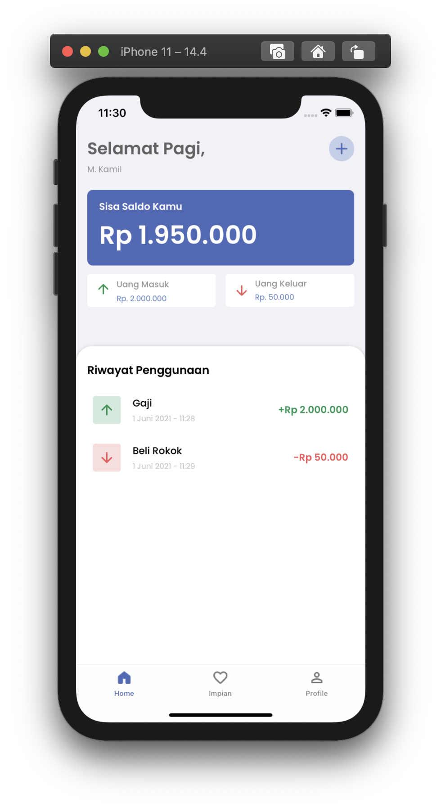
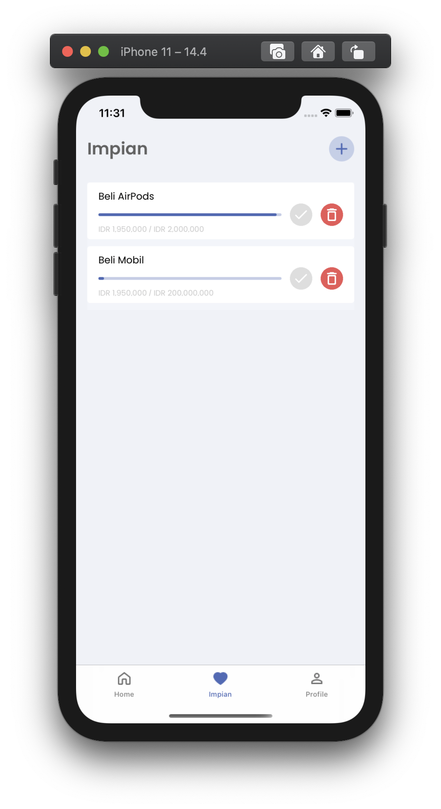
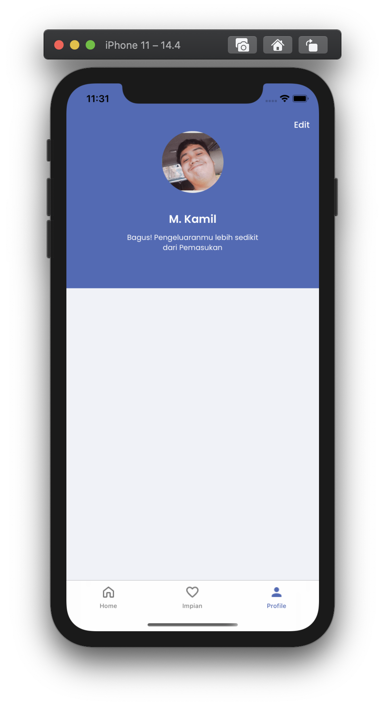
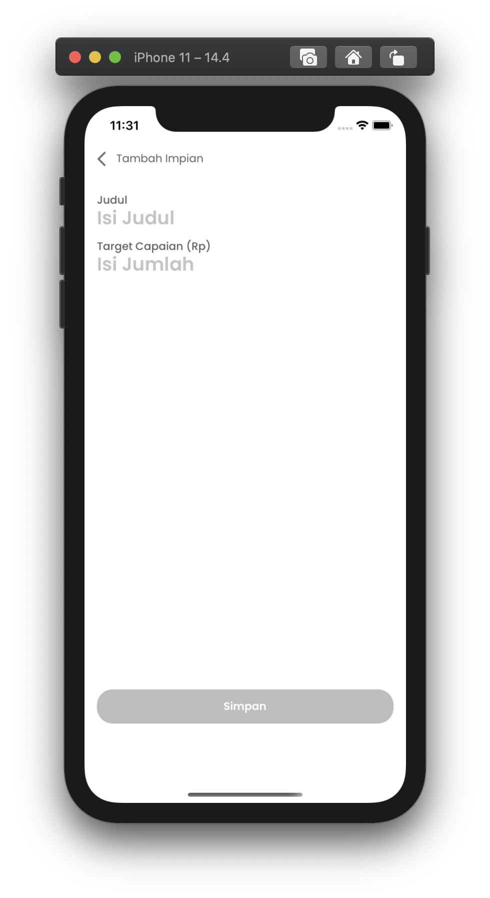
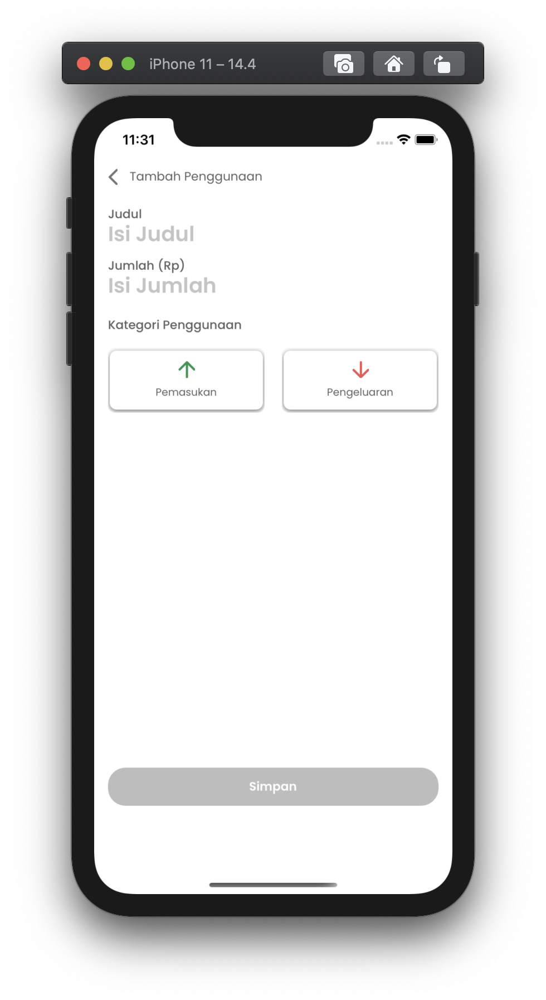

# MyMonee - iOS Swift Project

MyMonee is an iOS application that has a feature in the form of financial records. This financial record is divided into income and expenses from the user, the user can also view the balance. In this application there is also a recording of the dreams that the user wants to achieve, then from each recorded dream, the progress of the achievement can be seen based on the balance owned by the user.

<p align="center">
  
</p>

## Tech in Use
- Swift 5 & Xcode 12.4
- Java Spring for backend

## Screenshots
<p align="center">
  
  
</p>

## How To Install
1. Clone the repository using this command line in terminal
```$ git clone https://gitlab.com/kamil_mistar/mymonee```
2. Download the java spring backend in [MyMonee-Backend-Springboot](https://drive.google.com/file/d/1mpzGBMpK-dxsLPWrF8QCBix1dRzf2O_r/view?usp=sharing)
3. Install Oracle Java [JDK](https://www.oracle.com/java/technologies/javase/javase-jdk8-downloads.html)
4. Open terminal and locate to the file java springboot and run
```
$ java -jar mymonee-0.0.1-SNAPSHOT.jar
```
4. Open ZWallet.xcworkspace using XCODE
5. Last but not least, RUN the project and you finally can use the project

## Usage
* **Application**

  Application group contains configuration for the project such as AppDelegate, SceneDelegate, etc.
  
* **Configuration**
  
  Configuration group is like Helper for the project, parsing data etc
  
* **Controllers**
  
  Controllers contains all controller view in the project

* **Models**
  
  Models contains model data
  
* **Resources**

  Resouces contains font and all asset for the project
  
* **Response**

  Contains struct of response data from the network service
  
* **Service**

  contains api configuration
  
* **Views**
  
  Contains All view XIB 
  
