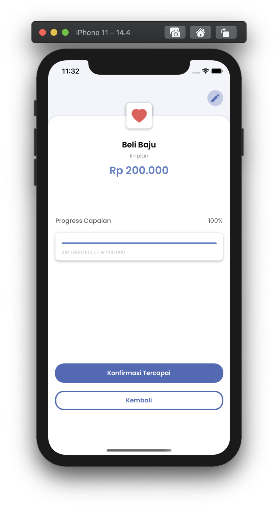

# ZWallet - iOS Swift with Viper Architecture
ZWallet is a mobile banking application designed for transactional activities. This application can make all transactions easier, faster, more practical, and safer
<p align="center">
  
</p>

## Tech in Use
- Swift 5 & Xcode 12.4
- JWT (JSON Web Token)
- VIPER
- Cocoapods

## Dependencies in Use
- Kingfisher
- Moya
- Netfox
- OTPFieldView
- NVActivityIndicatorView

## Screenshots
<p align="center">
  
  
</p>

## How To Install
1. Clone the repository using this command line in terminal
```$ git clone https://gitlab.com/kamil_mistar/mymonee```
2. Open ZWallet.xcworkspace using XCODE
3. Last but not least, RUN the project and you finally can use the project

## Usage
* **Application**

  Application group contains configuration for the project such as AppDelegate, SceneDelegate, etc.
  
* **Configuration**
  
  Configuration group is like Helper for the project, parsing data etc
  
* **Controllers**
  
  Controllers contains all controller view in the project

* **Models**
  
  Models contains model data
  
* **Resources**

  Resouces contains font and all asset for the project
  
* **Response**

  Contains struct of response data from the network service
  
* **Service**

  contains api configuration
  
* **Views**
  
  Contains All view XIB 
  
